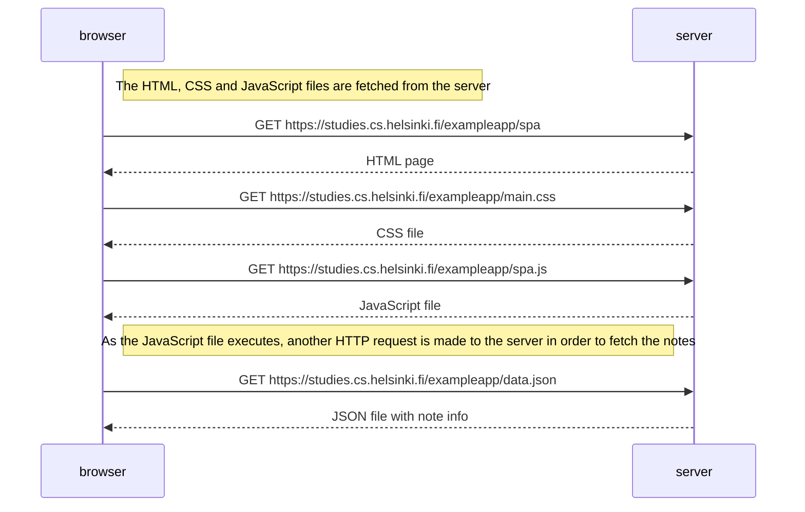

```mermaid
sequenceDiagram
    participant browser
    participant server

    Note right of browser: The HTML, CSS and JavaScript files are fetched from the server

    browser->>server: GET https://studies.cs.helsinki.fi/exampleapp/spa
		server-->>browser: HTML page

    browser->>server: GET https://studies.cs.helsinki.fi/exampleapp/main.css
		server-->>browser: CSS file

    browser->>server: GET https://studies.cs.helsinki.fi/exampleapp/spa.js
		server-->>browser: JavaScript file

    Note right of browser: As the JavaScript file executes, another HTTP request is made to the server in order to fetch the notes

    browser->>server: GET https://studies.cs.helsinki.fi/exampleapp/data.json
    server-->>browser: JSON file with note info
```

