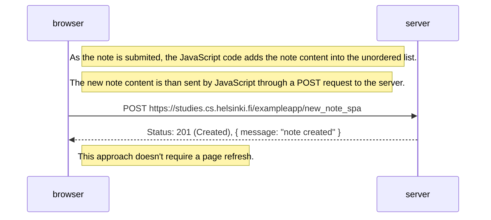

```mermaid
sequenceDiagram
    participant browser
    participant server

    Note right of browser: As the note is submited, the JavaScript code adds the note content into the unordered list.
    Note right of browser: The new note content is than sent by JavaScript through a POST request to the server.

    browser->>server: POST https://studies.cs.helsinki.fi/exampleapp/new_note_spa
		server-->>browser: Status: 201 (Created), { message: "note created" }

    Note right of browser: This approach doesn't require a page refresh.
```
